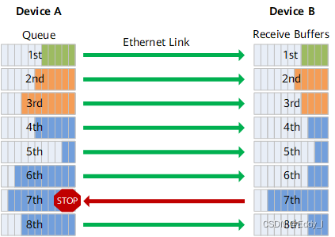
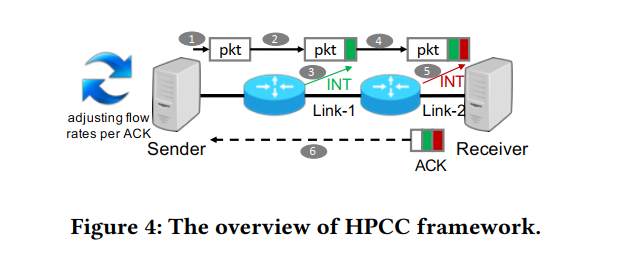
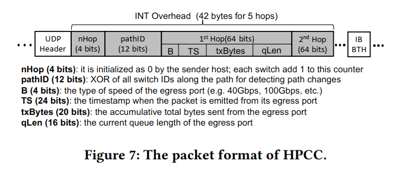

<h1>Congestion Control</h1>

## 一、基础知识

### InfiniBand(IB)

简单来说，$InfiniBand$ 的诞生目的，就是为了取代 $PCI$ 总线。它引入了 $RDMA$ 协议，具有更低的延迟，更大的带宽，更高的可靠性，可以实现更强大的 $I/O$ 性能。

### Pause

当下游设备接收能力小于上游设备的发送能力时，将通过 $Pause$ 帧停止整个接口的流量发送，如果上游的设备仍然拥堵，那就继续向上游设备发送 $Pause$ 帧，直到发送端。

### PFC

$PFC$ 是一种基于优先级的流量控制，相比 $Pause$ 而言只是暂停一种优先级的虚拟传输链路，不影响其他的链路。

但在复杂网络中，$PFC$ 可能存在死锁的问题。

### ECN

$ECN$ 可以理解为一种标签，由交换机产生，等到该标签传输到接受端的时候，对应的接受端会产生 $CNP$ 包将其发送给发送端，$CNP$

中包含了导致拥塞的 $Flow$ 或 $QP$，针对特定的 $Flow$ 或 $QP$ 进行速率的调整。

### RTT

$RTT$ 是端到端的延迟，包括传输延迟和排队延迟，也是 $TIMELY$ 网络拥塞控制算法的核心思想。

## 二、HPCC

### 相关CC工作

总结起来就是，在 $HPCC$ 出现之前，网络拥塞反馈的信号并不是“细粒度”的，例如 $DCQCN$、$TIMELY$

### In-Network Telemetry

简称 $INT$，可以用来收集和传输网络中各个节点上的实时性能数据，允许网络设备在数据包传输过程中插入元数据，这些消息可以被发送方通过接受到 $ACK$ 使用，进而进行流量控制或者拥塞控制。

### INT包格式

- $nHop$ 为数据包路径跳数计数（发送方会将其初始化为 $0$），路径上每个交换机将 $nHop$ 加 $1$。
- $pathID$ 为所有交换机 $ID$ 的异或（发送方会将其初始化为 $0$），发送方使用此数据判断流的路径是否已更改，如果更改则丢弃现有状态记录并建立新的记录。
- $B$ 是枚举类型，指示端口的速度类型。
- $TS$ 为时间戳。
- $txBytes$ 为到目前为止发送的总字节数，以 $128$ 字节为一个单位。
- $qLen$ 为队列长度，以 $80$ 字节为一个单位。

