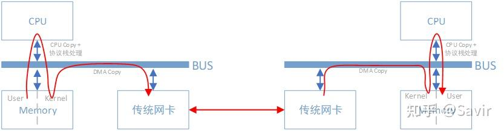
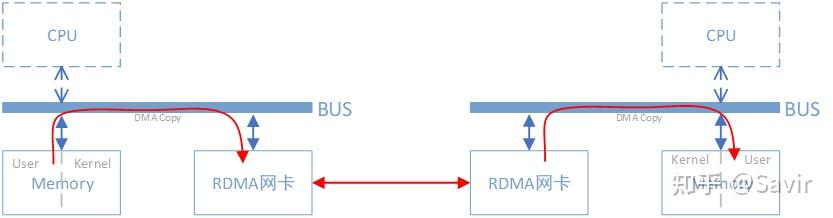
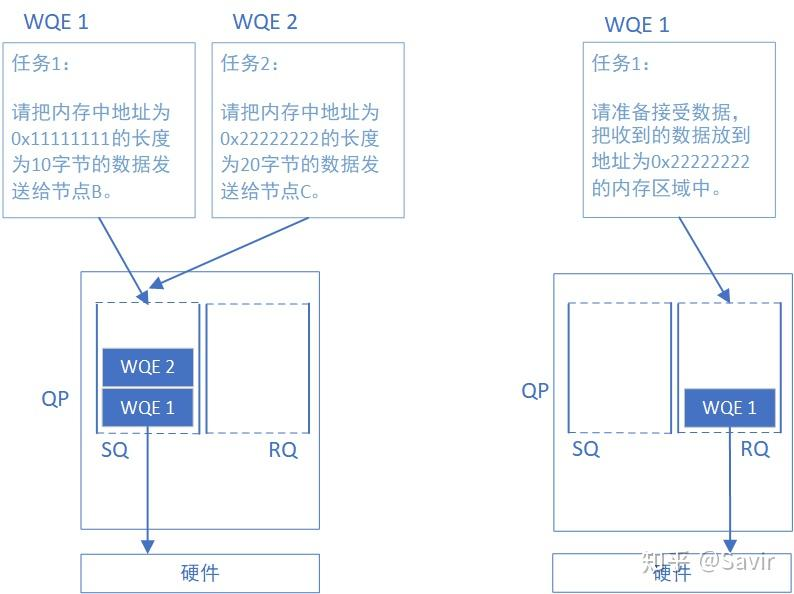
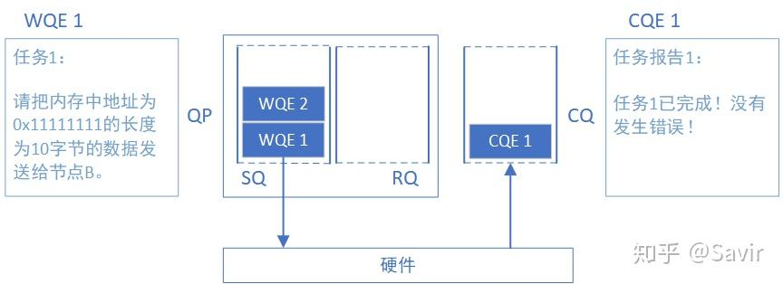

<h1>RDMA</h1>

本文学习内容均参考于知乎文章[《RDMA杂谈》](https://zhuanlan.zhihu.com/p/164908617)，也是个人的学习笔记。

## RDMA概述

$DMA$ 的工作就是对 $CPU$ 工作的一种减负，$DMA$ 控制器一般与 $I/O$ 设备组合在了一起。

然而，即使有了 $DMA$ 技术，$CPU$ 也需要将内存用户空间的数据拷贝到内核空间的缓冲区中，$CPU$ 干的事情还是很多。

而有了 $RDMA$ 之后，$CPU$ 就减少了从用户空间拷贝到内存空间的这部分冗余，少了这部分冗余又称之为“零拷贝”。

## RDMA基本元素

### 缩略词与解释

-  $WQ$ ：$Work \; Queue$ 工作队列，内部存放 $WQE$。

- $WQE$ ：$Work \; Queue \; Element$ 工作队列元素。

- $QP$ ：一对 $WQ$，是最基本的通信单元，并不是节点。

- $SQ$ ：$Send \; Queue$，$WQ$ 的具体实例，发送方的 $WQE$ 是具体要做的任务。

- $RQ$：$Receive \; Queue$，$WQ$ 的具体实例，接收方的 $WQE$ 是接收到数据后将其放到的具体位置，也要传递给硬件。

  

  

- $QPN$ ：$Queue\;Pair\;Number$，每个节点的每个 $QP$ 都有唯一的编号。

- $SRQ$ ：$Shared\;Receive\;Queue$，共享接收队列。

- $CQ$ ：$Completion\;Queue$，完成队列，概念类似于 $WQ$。

  

- $WR$ ：$Work\;Request$，用户角度的 $WQE$，$WQE$ 实际上对用户不可见。

- $WC$ ：$Work\;Completion$，用户角度的 $CQE$， $CQE$ 实际上对用户不可见。

