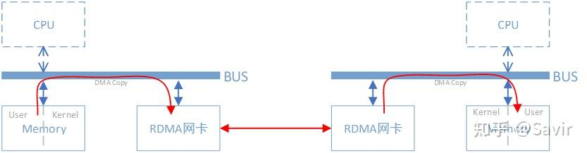

<h1>RDMA Learning</h1>

本文学习内容均参考于知乎文章[《RDMA杂谈》](https://zhuanlan.zhihu.com/p/164908617)，也是个人的学习笔记。

## RDMA概述

$DMA$ 的工作就是对 $CPU$ 工作的一种减负，$DMA$ 控制器一般与 $I/O$ 设备组合在了一起。

然而，即使有了 $DMA$ 技术，$CPU$ 也需要将内存用户空间的数据拷贝到内核空间的缓冲区中，$CPU$ 干的事情还是很多。

而有了 $RDMA$ 之后，$CPU$ 就减少了从用户空间拷贝到内存空间的这部分冗余，少了这部分冗余又称之为“零拷贝”。

