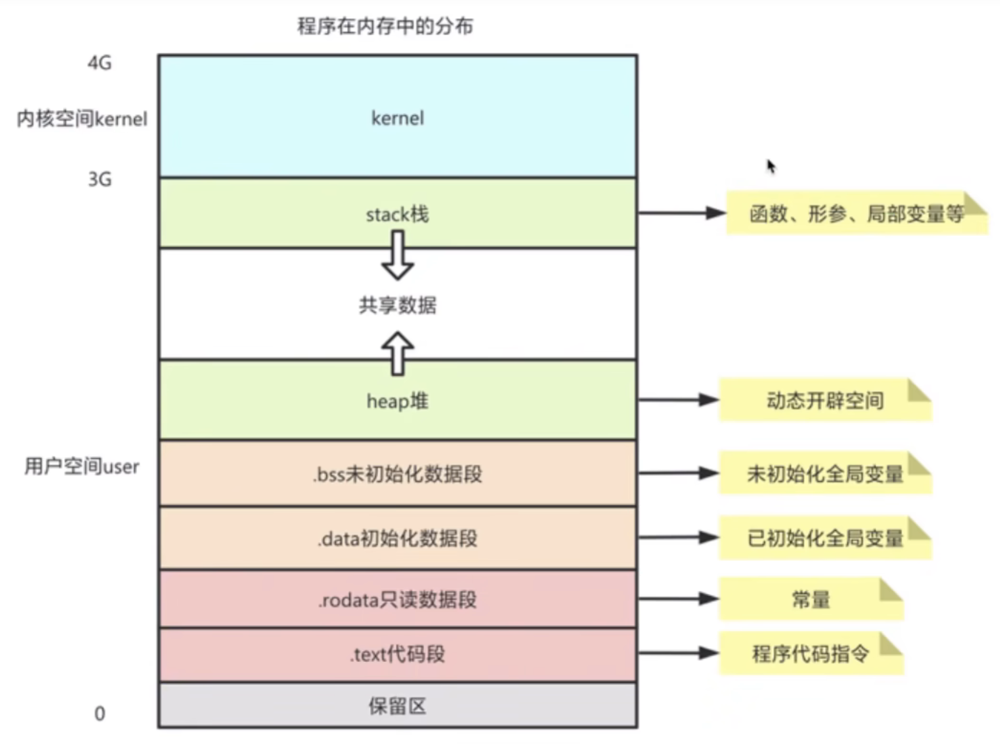

<center><h1>CPP</h1></center>


## 程序内存分布



- `data` 段：存储程序中已显式初始化的全局变量和静态变量，这些值在编译时确定，并直接写入可执行文件。
- `bss` 段：存储未显式初始化（或初始化为零）的全局变量和静态变量。程序加载时，操作系统会为 `bss` 段分配内存并清零，因此无需在可执行文件中存储实际数据，节省空间。


## static

- 修饰全局变量：存放在静态数据区（`.bss` 或 `.data`），作用域从整个工程缩到当前文件。

- 修饰局部变量：存放在静态数据区（`.bss` 或 `.data`），作用于不改变。

- 修饰类相关：

  - 修饰类中的函数：该函数属于类，不属于对象，可以直接用类来调用。
  - 修饰类中的变量：此变量由所有对象共同访问；此变量要在类外做初始化。

  （类的静态成员变量在使用前必须初始化，`static` 修饰的变量先于对象存在，所以必须在类外初始化）

  

- 静态方法能不能引用非静态资源？不能，实例化对象的时候才会产生的东西，对于初始化后就存在的静态资源来说，根本不认识它。
- 静态方法里面能不能引用静态资源？可以，因为都是类初始化的时候加载的，大家相互都认识。
- 非静态方法里面能不能引用静态资源？可以，非静态方法就是实例方法，是实例化对象之后产生的，那么属于类的内容它都认识。


## const

- 全局 `const` 存储在静态存储区；局部 `const` 存储在栈上，函数调用时分配；修饰“字符串常量”时，存储在常量存储区。
- `const` 与指针，常量指针和指向常量的指针。


## 智能指针

### unique_ptr

- 指针指向的对象是独占的，没有实现拷贝构造函数。如果需要拷贝构造，用 `move` 函数。
- 大小与普通指针一致，为八字节。

### shared_ptr

- 有拷贝构造函数，可以指向同一对象，所以没有 `release` 函数。
- `use_count()`、`unique()` 函数。
- 初次指向对象，创建指向控制块，其中的 `use_count++`，不改变其中的`weak_count`。 
- 可能会出现循环引用，类中定义指向当前类的指针，造成内存泄漏。

### weak_ptr

- 与 `shared_ptr` 共同使用，可以使用 `shared_ptr` 拷贝构造，同时不改变 `use_count` 引用计数。
- `expired()`：判断是否存在观测对象。
- 初次指向对象，创建指向控制块，其中的 `weak_count++`，不改变其中的`use_count`。
- `lock()`：用该函数获得一个`shared_ptr` ，并且是原子操作。


## 四种强制类型转换

四种强制类型转换都是运算符，不是模版。

### static_cast

- 类似 `C` 语言的转换，静态转换。
- 可以转换基本数据类型，不能转换指针类型，但可以转换成 `void*`，可以搭桥转。

### reinterpret_cast

- 仅仅是重新解释二进制位的含义，强制转换。

### const_cast

- 添加或移除 `const`。
- 去除常量指针的 `const` 试图修改常量，会引发未定义行为。

### dynamic_cast

- 把父类指针转换成子类指针。
- 运行时检查，返回是否转换成功。


## 构造函数


## 巧用构造函数

```cpp
outboundMsgMap.emplace(std::piecewise_construct, 
                       std::forward_as_tuple(msgId),
                       std::forward_as_tuple(sendMsg, this, msgId, reqUnschedDataVec));

OutboundMessage* outboundMsg = &(outboundMsgMap.at(msgId));
```

- 前者将创建键值对，后者在指定这个值的时候，会自动调用构造函数，因为其中的 $OutBoundMessage$ 有如下构造函数：

```cpp
explicit OutboundMessage(AppMessage* outMsg,
                         SendController* sxController,
                         uint64_t msgId,
                         std::vector<uint16_t> reqUnschedDataVec);
```


## Lambda表达式

### 基本语法

#### 定义

``` 
[captures] (params) specifiers exception -> ret {body}
```


#### 举例

```cpp
int main() {
  int x = 5;
  auto foo = [x](int y) -> int {return x * y};
  cout << foo(8) << endl;
}
```

- 捕获列表
  - 只能捕获非静态、局部变量，这样的设计是因为静态变量与全局变量可以直接用，根本不需要捕获。
- 限定词
  - 默认：$auto$ 类型为 $int\;(int)\;const$
  - 添加限定词 $mutable$：$auto$ 类型为 $int\;(int)$，这时修改捕获变量，在下次调用仍然存在。
  - 如果捕获列表添加引用，则意味着内部修改会影响外部。
  - 简单说就是，里面修改对外面没影响，外面修改对里面也没影响。
- 返回值
  - 可以做隐式的类型转换。
  - 可以省略，由 $return$ 给出。
- 最简单的形式 `[]{}`


### 特殊的捕获方法

- `[this]` ：可以捕获 $this$ ，即获得了对象的作用域。
- `[=]` ：捕获 $lambda$ 表达式定义作用域的全部变量的值。
- `[&]` ：捕获 $lambda$ 表达式定义作用域的全部变量的引用。


### 一些实例

- 函数递归调用

  ```cpp
  // 写法1
  vector<vector<int>> subsets(vector<int>& nums) {
      vector<vector<int>> ans;
      vector<int> path;
  
      auto dfs = [&](this auto&& dfs, int cur) -> void {
          if (cur == nums.size()) {
              ans.push_back(path);
              return;
          }
          // 选
          path.push_back(nums[cur]);
          dfs(cur + 1); 
          path.pop_back();
          // 不选
          dfs(cur + 1); 
      };
  
      dfs(0);
      return ans;
  }
  
  // 写法2 换掉参数内的dfs名称
  vector<vector<int>> subsets(vector<int>& nums) {
      vector<vector<int>> ans;
      vector<int> path;
  
      auto dfs = [&](this auto&& nihao, int cur) -> void {
          if (cur == nums.size()) {
              ans.push_back(path);
              return;
          }
          // 选
          path.push_back(nums[cur]);
          nihao(cur + 1); 
          path.pop_back();
          // 不选
          nihao(cur + 1); 
      };
  
      dfs(0);
      return ans;
  }
  
  
  // 写法3 不写this
  vector<vector<int>> subsets(vector<int>& nums) {
      vector<vector<int>> ans;
      vector<int> path;
  
      auto dfs = [&](auto&& dfs, int cur) -> void {
          if (cur == nums.size()) {
              ans.push_back(path);
              return;
          }
          // 选
          path.push_back(nums[cur]);
          dfs(dfs, cur + 1); 
          path.pop_back();
          // 不选
          dfs(dfs, cur + 1); 
      };
  
      dfs(dfs, 0);
      return ans;
  }
  
  // 写法4 不写auto 效率会慢
  vector<vector<int>> subsets(vector<int>& nums) {
      vector<vector<int>> ans;
      vector<int> path;
  
      function<void(int)> dfs = [&](int cur) -> void {
          if (cur == nums.size()) {
              ans.push_back(path);
              return;
          }
          // 选
          path.push_back(nums[cur]);
          dfs(cur + 1); 
          path.pop_back();
          // 不选
          dfs(cur + 1); 
      };
  
      dfs(0);
      return ans;
  }
  ```


## STL

### vector

- 清空：`clear`


### string

- 删除最后字符：`pop_back`


## 特性

### ranges

- $ranges::sort()$

```cpp
// 默认升序排序，可以使用Lambda表达式自定义排序函数
std::ranges::sort(); 
```


