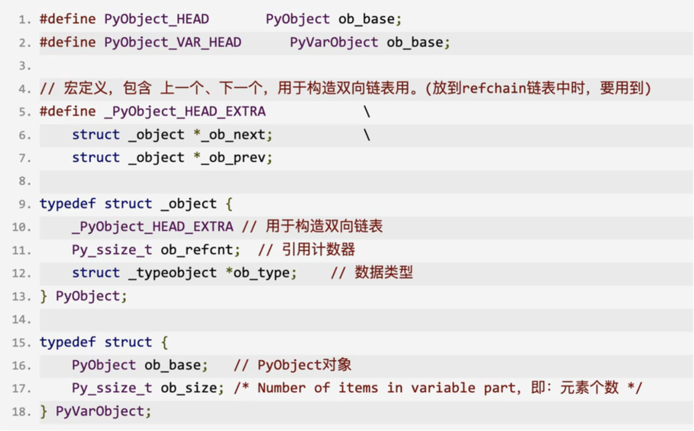
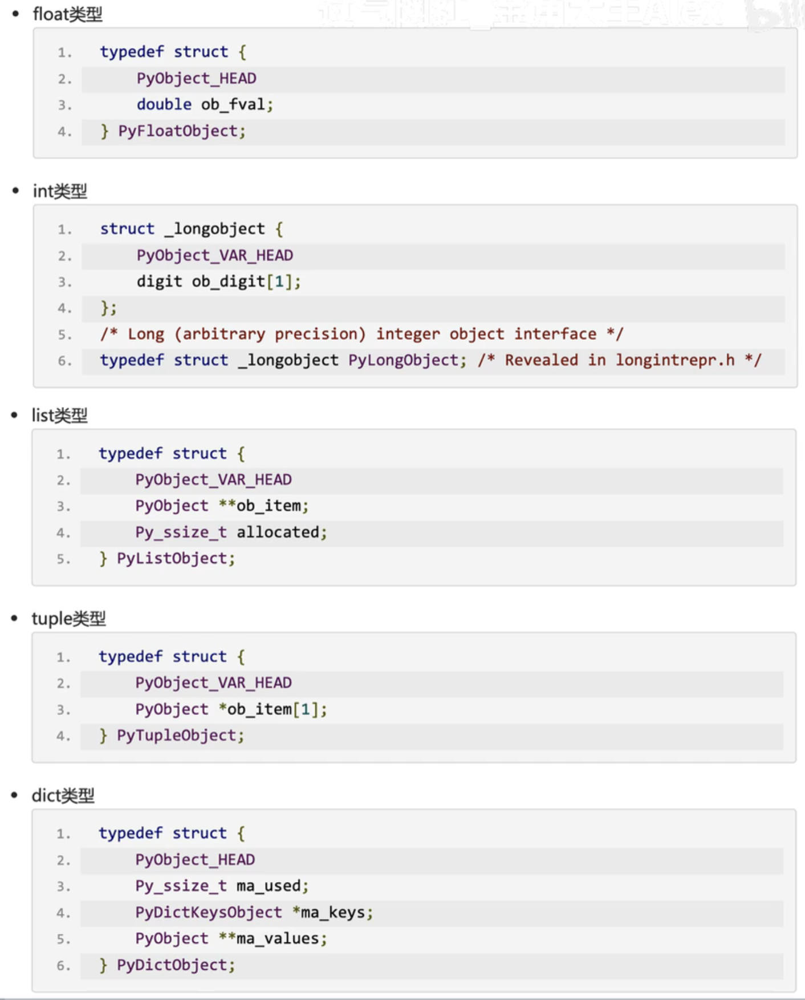

<h1>Python</h1>

## 内存管理机制

### 1  引用计数器

#### 1.1  环状双向链表refchain

创建的任何对象都会放在 `refchain` 中。

`PyObject` 结构体和 `PyVarObject` 结构体定义如下图所示：

各种数据类型的定义如下：

值得注意的是：`int` 是 `PyVarObject` ，因为 `int` 要做到可扩展大小。

#### 1.2  引用计数器

### 2  标记清除

### 3  分代回收

### 4  缓存机制

### 5  剖析源码

